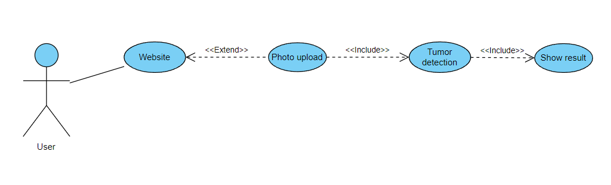

# Tumour Detection App
Projekt wykonany w ramach przedmiotu Wprowadzenie do aplikacji i rozwiązań opartych o Sztuczną Inteligencję i Microsoft Azure. 

# Opis 
Niewątpliwie każdy wie jak ważna dziedziną jest medycyna. Wspieranie jej stałego rozwoju to troska o zdrowie każdego człowieka. Z tą myślą podjęliśmy próbę 
storzenia apliacjkacji pomocnej wykrywającej guzy. Aplikacja ma usprawnić ten proces oraz zapewniać jego niezawodność.

# Autorzy: 
* Lidia Łachman

## Architektura aplikacji w Azure

## Diagram przypadków użycia

## Azure Machine Learning 

## Strona internetowa
Strona internetowa powstała z wykorzystaniem frameworka Flask - implementacja wykonana została w języku Python. Pełen kod do implementacji znajduje się
w tym repozytorium pod nazwą tumor_detection_web_app. Podjęta została próba uruchomienia aplikacji w Web App. Z powodu braku uprawnień nie udało utworzyć Web App
w zasobach grupy. Z tego względu przetestowano podejście lokalne zakończone powodzeniem. Do podejścia lokalnego wykorzystano rozszerzenie Azure w Visual Studio oraz 
połączenie z Github. Istnieje również możliwość uruchomienia aplikacji na utworoznej wcześcniej maszynei wirtualnej. Z racji braku możliwości utworzenia jakichkolwiek zasobów 
nie zostało to przetestowane.

